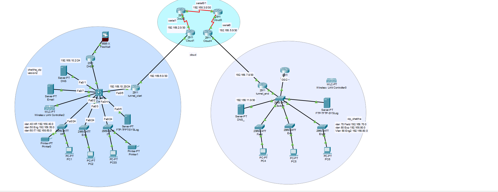

# 🌐 Enterprise Network Simulation using Cisco Packet Tracer

This project simulates a full-scale enterprise network with **multiple VLANs**, **VPN tunnel**, **firewall**, **DHCP**, **DNS**, **FTP**, **WLC**, and more using **Cisco Packet Tracer**.

## 📌 Features Implemented

- VLANs and Inter-VLAN Routing
- VPN Tunnel Simulation
- DHCP Server (Centralized)
- DNS Server
- FTP / SYSLOG / TFTP
- Wireless LAN Controller (WLC)
- Cisco ASA Firewall Configuration
- VTP Version 2 for VLAN propagation
- Layer 3 and Layer 2 Switch Configuration
- Dynamic Routing (can be added)

## 🗂️ Topology Overview

> The network is segmented into two main LANs (Head Office and Branch), connected via VPN over a simulated WAN cloud.

## 🧠 Technologies Used

| Tool/Protocol | Purpose |
|---------------|---------|
| Cisco Packet Tracer | Network Simulation |
| DHCP | Dynamic IP allocation |
| DNS | Name Resolution |
| FTP / TFTP | File Transfer and Backup |
| SYSLOG | Central Logging |
| VPN (Manual Tunnel) | Secure Inter-site Communication |
| VLAN | Logical Segmentation |
| ASA 5506-X | Firewall Security |

## 📁 Files

| File | Description |
|------|-------------|
| `enterprise-network.pkt` | Cisco Packet Tracer project file |
| `screenshots/topology.png` | Network topology diagram |

## 🚀 How to Run

1. Install **Cisco Packet Tracer 8.2 or above**.
2. Download the `.pkt` file from this repo.
3. Open it in Packet Tracer.
4. Run simulations and ping across networks to test connectivity.

## 📢 Notes

- VPN tunnels are simulated using routers with static routing.
- All VLANs and DHCP pools are pre-configured.
- Firewall ACLs are implemented to control traffic.
- Basic wireless setup is included using WLCs.

## 📧 Author

**Kuldip Ramavat**  
ECE Dept | LDCE  
🔒 Cybersecurity & Networking Enthusiast

---

Feel free to fork, use, and improve this repo! Contributions are welcome.
